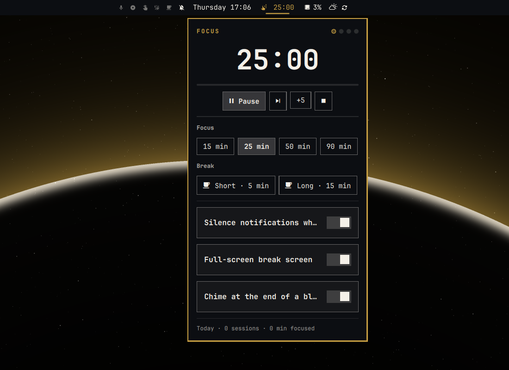
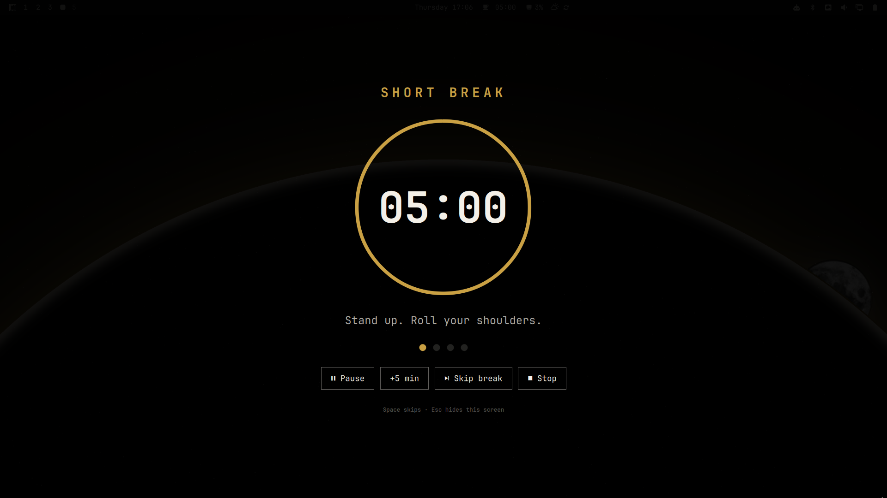

# Omarchy Pomodoro

A **focus timer** for the [Omarchy](https://omarchy.org/) bar: countdown in the center strip, popup controls, full-screen break screen, Do Not Disturb while you focus, chimes, and daily stats — with a session that survives shell restarts and suspend.

> **⚡ Built for Omarchy:** classic **25 · 5 · 15** rhythm out of the box. This repo is [austrasien](https://github.com/austrasien)’s fork of [techywilbur/omarchy-pomodoro](https://github.com/techywilbur/omarchy-pomodoro), with an extra fix so clicks still work when you run a **cloned bar** (e.g. `austraz.bar`) on Omarchy 4.0.3+.

```
Bar chip  →  popup / right-click start  →  focus → break screen → next block
```

Upstream credit: **Wilbur Lindqvist ([techywilbur](https://github.com/techywilbur))** — MIT. Plugin id stays `techywilbur.pomodoro` so an existing bar entry keeps working.

---

### ☕ Support the Project
If this saves you from a dead bar click after an Omarchy update, a tip is always appreciated.

[](https://paypal.me/austraz)

---

### 💬 Feedback & Community
Got a question, found a bug, or have a suggestion? Open an [**issue**](https://github.com/austrasien/omarchy-pomodoro/issues).

---

## 🚀 Overview

Omarchy’s Quattro shell hosts bar widgets as plugins. Upstream Pomodoro is excellent on the stock `omarchy.bar`. On **cloned bars**, Omarchy 4.0.3+ sandboxes `serviceFor()` so the widget never becomes “ready” and **left-click does nothing** — while the timer engine itself is still healthy over IPC.

**Why this fork?**

| | Upstream only ❌ | This fork ✅ |
| :--- | :--- | :--- |
| **Stock `omarchy.bar`** | Works | Works (same path) |
| **Cloned bar** (`*.bar`) | Click does nothing | Widget finds the engine via a shared bridge |
| **Plugin id** | `techywilbur.pomodoro` | Same — no `shell.json` rewrite |
| **Break screen / DND / chimes** | Yes | Yes (unchanged upstream behaviour) |

> **Note:** The fix is a fallback only. `BarWidget` still prefers `bar.shell.serviceFor(...)`; if that returns `null`, it uses the live `Service` handle registered in `PomoModel.js` (`.pragma library`).

## ✨ Key Features

### ⏱ Bar + popup
- Idle icon, countdown while focus/break runs, thin progress hairline under the chip.
- Left click → popup (Start / Pause / Skip / +5 / Stop, presets, toggles).
- Right click → start / pause / resume · Middle click → skip · Scroll → ±1 min.

### 🛡 Break screen
- Full-screen overlay on every monitor with a progress ring and tips.
- `Esc` hides the overlay for the rest of the break; `Space` / `Enter` skips or continues.
- Optional auto-start break; focus after a break waits for you by default.

### 🔕 Focus hygiene
- Do Not Disturb for the length of a focus block (restores previous state).
- Chime + desktop notification at block end (`pw-play` / `paplay`).

### 💾 Restart-proof
- Wall-clock end time + `~/.local/state/uni-pomo/state.json`.
- Bounded `pomo-state-read` helper (`O_NOFOLLOW`, size/owner checks).





## 🛠 Installation (Omarchy)

```sh
omarchy plugin add https://github.com/austrasien/omarchy-pomodoro.git --enable
```

`--enable` places the widget in the bar center (you can pick a section when prompted). Already on upstream? Point the remote at this fork:

```sh
cd ~/.config/omarchy/plugins/techywilbur.pomodoro
git remote set-url origin https://github.com/austrasien/omarchy-pomodoro.git
git pull
omarchy restart shell
```

Move it later:

```sh
omarchy bar move techywilbur.pomodoro --section center
```

### Update / remove

```sh
omarchy plugin update techywilbur.pomodoro
omarchy plugin remove techywilbur.pomodoro
```

State file (optional cleanup): `~/.local/state/uni-pomo/state.json`.

### Requirements
- Omarchy Quattro shell (`omarchy-shell` / Quickshell)
- `pipewire` (`pw-play`) or `pulseaudio` (`paplay`) + freedesktop sounds (or set `sound` to `false`)
- `python3` (stdlib only) for the state reader
- Optional CLI helper: `jq`

No sudo / pkexec.

## ⚙️ Settings

Inline on the widget entry in `~/.config/omarchy/shell.json` (also via popup toggles / bar settings).

| Key | Default | Meaning |
|---|---|---|
| `focus` | `25` | Focus block (minutes) |
| `shortBreak` | `5` | Short break |
| `longBreak` | `15` | Long break |
| `longEvery` | `4` | Long break every N focus blocks (`0` = never) |
| `presets` | `[15, 25, 50, 90]` | Popup preset buttons |
| `dnd` | `true` | DND during focus |
| `overlay` | `true` | Full-screen break screen |
| `sound` / `notify` | `true` | Chime / notification |
| `autoStartBreak` | `true` | Auto-start break after focus |
| `autoStartFocus` | `false` | Auto-start next focus after break |
| `staleAfter` | `30` | Drop a restored timer if it ended this many minutes ago |

## 🔌 IPC / optional CLI

```sh
omarchy-shell pomodoro status
omarchy-shell pomodoro toggle          # start / pause / resume
omarchy-shell pomodoro focus 50
omarchy-shell pomodoro skip | stop
omarchy-shell shell toggle techywilbur.pomodoro   # popup
```

Optional `uni-pomo` CLI and extras live in the repo (`uni-pomo`, `extras/bindings.lua`, `extras/omarchy-menu.jsonc`).

## ⚖️ License

Licensed under the **MIT License** (upstream [techywilbur/omarchy-pomodoro](https://github.com/techywilbur/omarchy-pomodoro)).

---
*Forked so Pomodoro still opens when your Omarchy bar is a clone — not only on stock `omarchy.bar`.*
